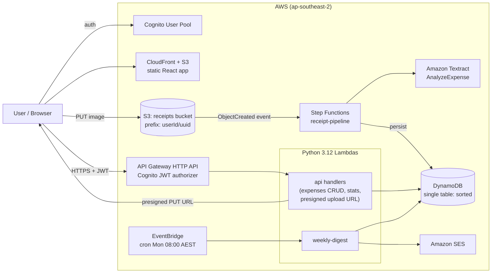
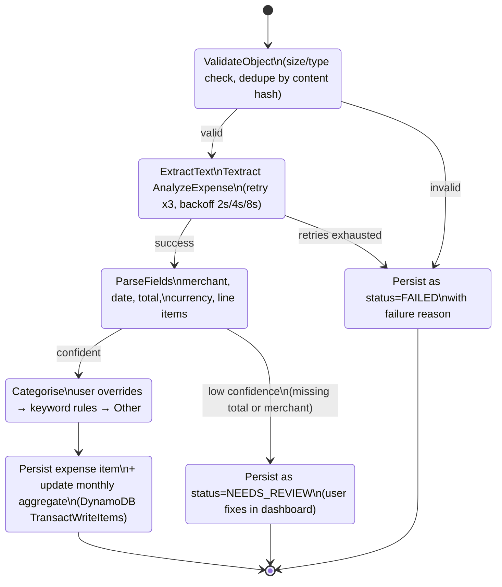
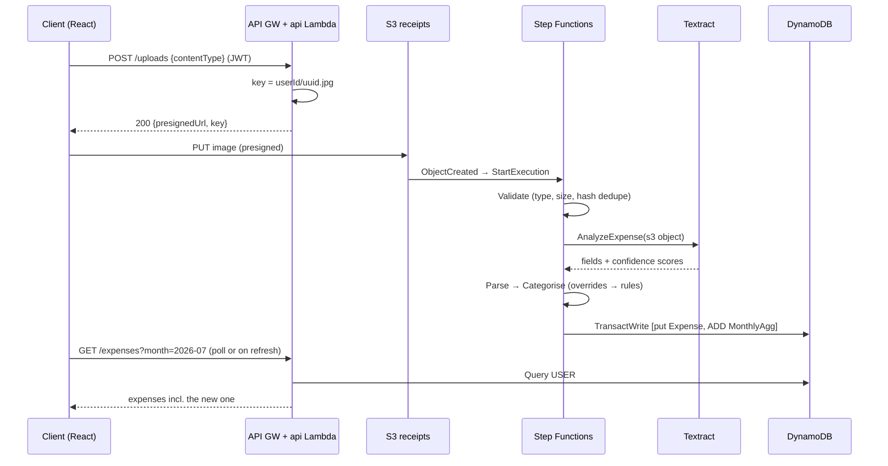
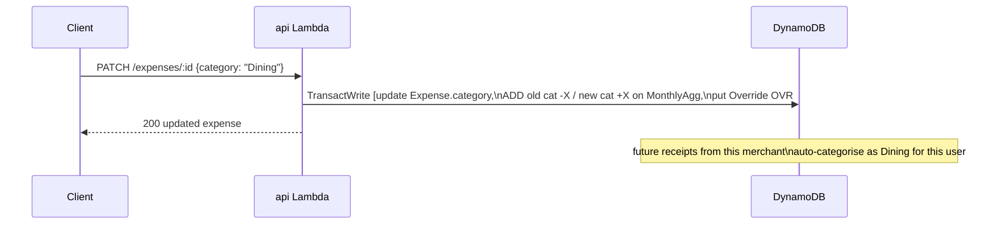
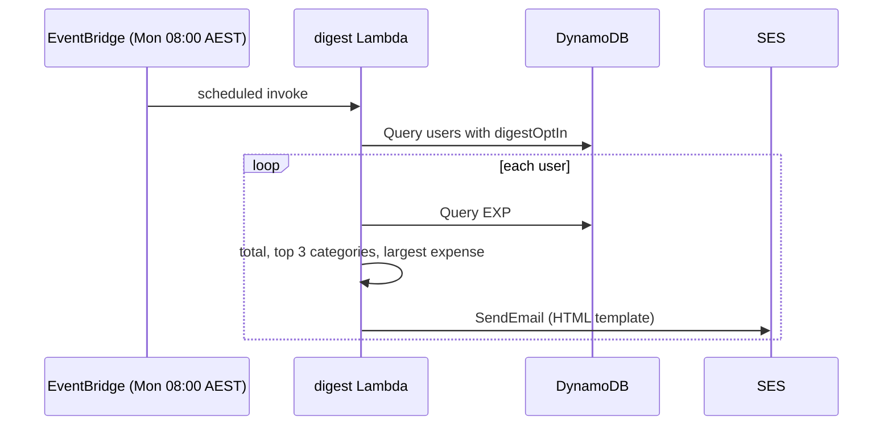
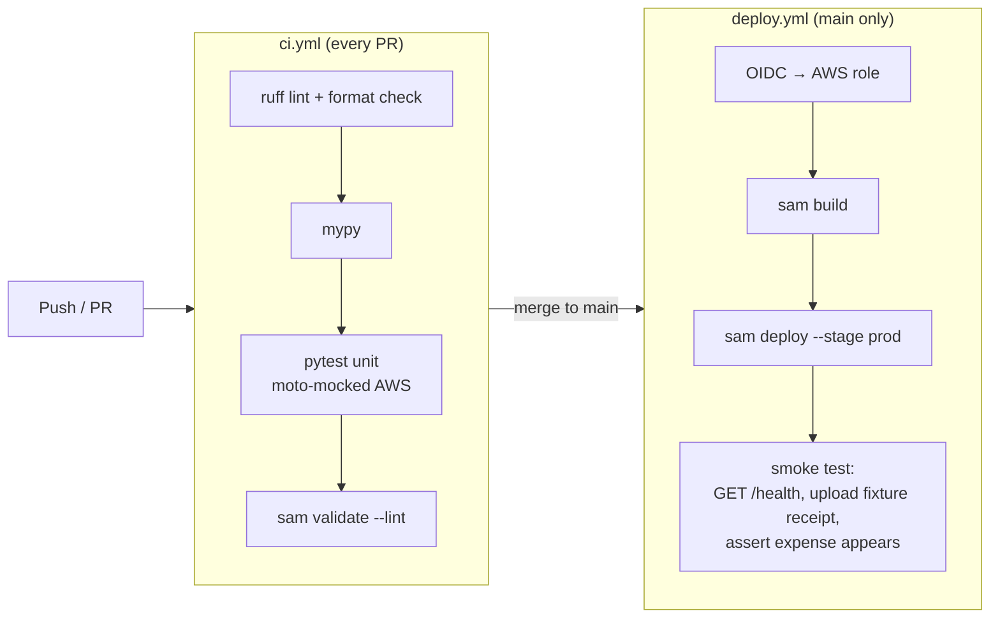

# Sorted — Serverless Receipt & Expense Tracker

Photograph a receipt, get a categorised expense. Sorted ingests receipt images, extracts merchant/date/total with Amazon Textract, categorises the spend, stores it in DynamoDB, and shows monthly spending on a dashboard with a weekly summary email.

**Stack:** Python 3.12 · AWS SAM · Lambda · API Gateway · Step Functions · Textract · DynamoDB · S3 · Cognito · EventBridge · SES · React (Vite)

> **Why this project exists:** a companion to [Pulse](https://github.com/ibilawalkhan/pulse). Pulse demonstrates container-based, schedule-driven architecture (ECS, SQS, Terraform, TypeScript); Sorted demonstrates **event-driven serverless** architecture (Lambda, Step Functions, DynamoDB single-table design, SAM, Python). Together they cover the two dominant AWS backend patterns. Design decisions are documented in [section 9](#9-design-decisions).

---

## Table of Contents

1. [Features (MVP scope)](#1-features-mvp-scope)
2. [System Architecture](#2-system-architecture)
3. [Processing Pipeline (Step Functions)](#3-processing-pipeline-step-functions)
4. [Data Model (DynamoDB single-table)](#4-data-model-dynamodb-single-table)
5. [Core Flows (Sequence Diagrams)](#5-core-flows-sequence-diagrams)
6. [API Specification](#6-api-specification)
7. [Repository Structure](#7-repository-structure)
8. [CI/CD Pipeline](#8-cicd-pipeline)
9. [Design Decisions](#9-design-decisions)
10. [Local Development](#10-local-development)
11. [Configuration](#11-configuration)
12. [Delivery Plan & Milestones](#12-delivery-plan--milestones)
13. [Out of Scope (Deliberately)](#13-out-of-scope-deliberately)
14. [Future Improvements](#14-future-improvements)

---

## 1. Features (MVP scope)

| # | Feature | Description |
|---|---------|-------------|
| F1 | **Auth** | Sign-up / sign-in via Amazon Cognito (hosted UI or SDK); API authorised by Cognito JWT authorizer |
| F2 | **Receipt upload** | Client requests a presigned S3 URL, uploads image (JPEG/PNG/PDF ≤ 5 MB) directly to S3 |
| F3 | **Extraction pipeline** | S3 event triggers a Step Functions execution: Textract → parse → categorise → persist. Failures land in a quarantine state with reason |
| F4 | **Auto-categorisation** | Rule-based: merchant keyword map → category (Groceries, Dining, Transport, Utilities, Shopping, Health, Other). User can re-categorise; corrections are stored as per-user overrides applied to future receipts from the same merchant |
| F5 | **Expenses API + dashboard** | List/filter expenses by month + category; monthly totals by category; edit amount/merchant/category; delete |
| F6 | **Weekly digest** | EventBridge schedule (Mon 8am Sydney) → digest Lambda → SES email: last week's total, top categories, biggest expense |

**MVP:** photograph a real receipt on a phone → categorised expense visible on the live dashboard within ~15 seconds; weekly email arriving; all infrastructure deployed via SAM through the CI/CD pipeline only.

---

## 2. System Architecture



**Key properties:**

- **No servers, no idle cost.** Every compute unit is a Lambda; the system costs ~$0 at personal usage.
- **Upload bypasses the API.** Clients upload directly to S3 with a presigned URL — the standard pattern for binary ingestion (API Gateway has a 10 MB payload limit and charges for transfer).
- **The pipeline is event-driven.** Nothing polls; S3 `ObjectCreated` starts the state machine.

---

## 3. Processing Pipeline (Step Functions)



## 4. Data Model (DynamoDB single-table)

One table, `sorted`, with generic keys and two GSIs. Access patterns first, schema second — the DynamoDB way.

**Access patterns:**

| # | Pattern | Served by |
|---|---------|-----------|
| P1 | Get all expenses for user, newest first (paginated) | Base table query |
| P2 | Get expenses for user in month X | Base table, `begins_with(SK)` |
| P3 | Get expenses for user by category in month | GSI1 |
| P4 | Get monthly totals per category (dashboard) | Aggregate items, base table |
| P5 | Get user's merchant→category overrides | Base table, `begins_with(SK)` |
| P6 | Dedupe check by content hash | GSI2 |

**Item types:**

| Entity | PK | SK | GSI1PK | GSI1SK | Attributes |
|---|---|---|---|---|---|
| Expense | `USER#<sub>` | `EXP#<date>#<uuid>` | `USER#<sub>#CAT#<cat>` | `<date>` | merchant, total, currency, category, status (OK / NEEDS_REVIEW / FAILED / DUPLICATE), s3Key, contentHash, lineItems[], createdAt |
| MonthlyAgg | `USER#<sub>` | `AGG#<yyyy-mm>` | — | — | totalsByCategory (map), expenseCount, grandTotal |
| Override | `USER#<sub>` | `OVR#<merchantNorm>` | — | — | category, updatedAt |
| Profile | `USER#<sub>` | `PROFILE` | — | — | email, digestOptIn, createdAt |

- **GSI2:** `GSI2PK = USER#<sub>#HASH#<sha256>` → dedupe lookup (P6).
- `<date>` is ISO `yyyy-mm-dd`, so `SK begins_with "EXP#2026-07"` serves P2 with no scan.
- **MonthlyAgg is updated transactionally with the expense write** (`TransactWriteItems`: put expense + `ADD` to aggregate). Dashboard reads are then single-digit-millisecond key lookups instead of aggregation queries — a deliberate read-optimisation trade-off (see Design Decisions #4).

---

## 5. Core Flows (Sequence Diagrams)

### 5.1 Upload → processed expense



### 5.2 Re-categorisation with learning



### 5.3 Weekly digest



---

## 6. API Specification

HTTP API (API Gateway v2), Cognito JWT authorizer on every route except `/health`.

| Method | Path | Description |
|---|---|---|
| POST | `/uploads` | Returns presigned S3 PUT URL for a receipt image |
| GET | `/expenses?month=yyyy-mm&category=&cursor=` | List expenses (paginated) |
| GET | `/expenses/:id` | Expense detail incl. line items + receipt image (presigned GET) |
| PATCH | `/expenses/:id` | Edit merchant/total/date/category (category edit writes an Override) |
| DELETE | `/expenses/:id` | Delete expense (adjusts MonthlyAgg transactionally) |
| GET | `/stats?month=yyyy-mm` | Monthly totals by category (reads MonthlyAgg item) |
| GET | `/profile` / PATCH `/profile` | Digest opt-in/out |
| GET | `/health` | Unauthenticated liveness |

Request/response validation with **Pydantic v2** models shared across all Lambdas (`src/shared/models.py`). Errors use a consistent `{statusCode, message, error}` envelope.

---

## 7. Repository Structure

```
sorted/
├── README.md                     # this document
├── template.yaml                 # AWS SAM template — ALL infrastructure
├── samconfig.toml                # SAM deploy config (per stage)
├── pyproject.toml                # ruff, pytest, mypy config
├── requirements.txt              # runtime deps (boto3 provided by Lambda)
├── requirements-dev.txt
├── statemachine/
│   └── pipeline.asl.json         # Step Functions definition (retries, catches)
├── src/
│   ├── shared/                   # Lambda layer: models, dynamo repo, logging
│   │   ├── models.py             # Pydantic entities + API DTOs
│   │   ├── repo.py               # single-table access (all PK/SK logic lives here)
│   │   ├── categories.py         # keyword rules + override resolution
│   │   └── logger.py             # structured JSON logging (aws_lambda_powertools)
│   ├── api/                      # one module per route group
│   │   ├── uploads.py  expenses.py  stats.py  profile.py  health.py
│   ├── pipeline/
│   │   ├── validate.py  extract.py  parse.py  categorise.py  persist.py
│   └── digest/
│       └── handler.py
├── tests/
│   ├── unit/                     # parse/categorise/repo logic (moto for AWS mocks)
│   └── integration/              # invoke against deployed dev stack
├── web/                          # React + Vite dashboard
│   └── src/ (pages: SignIn, Expenses, ExpenseDetail, Stats)
└── .github/workflows/
    ├── ci.yml                    # ruff + mypy + pytest + sam validate
    └── deploy.yml                # OIDC → sam build/deploy → smoke test
```

---

## 8. CI/CD Pipeline



- The smoke test is end-to-end: it uploads a fixture receipt image and polls the API until the expense appears (or fails the deploy). A pipeline that proves the pipeline.

---

## 9. Design Decisions


1. **Step Functions over a single "do-everything" Lambda.** Retries, backoff, per-stage failure handling, and execution history are declared, not coded; each stage is small and testable; the console visualisation is the demo. Trade-off: more moving parts than one function — worth it the moment a pipeline has ≥3 stages and distinct failure modes.
2. **Textract `AnalyzeExpense` over generic OCR (or an LLM).** Purpose-built for receipts/invoices, returns typed fields with confidence scores, no prompt-injection surface, predictable pricing. An LLM could handle weird layouts better — noted under Future Improvements as an *assist*, not the backbone.
3. **DynamoDB single-table over relational.** The access patterns (section 4) are all key lookups — DynamoDB serves every one without joins at effectively zero cost and zero ops. Trade-off: ad-hoc queries are painful; that's what the design-first access-pattern table mitigates. (Deliberate contrast with Pulse, which correctly used Postgres for relational, time-series-ish data.)
4. **Pre-computed MonthlyAgg items over query-time aggregation.** Dashboard reads become O(1) key gets; the cost is transactional dual-writes on every expense mutation. Correct trade for read-heavy dashboards; documented failure mode: aggregates are recoverable by re-scanning a user's expenses.
5. **Presigned S3 upload over multipart-through-API.** Removes API Gateway's payload limit and per-GB cost, and the S3 event is the natural pipeline trigger.
6. **Cognito over hand-rolled JWT.** Cognito shows managed-service range: hosted UI, token rotation, and an API Gateway authorizer with zero auth code in Lambdas.
7. **SAM over Terraform here.** SAM is the serverless-native tool (local invoke, built-in packaging, one template).
8. **Rule-based categorisation with per-user overrides over ML.** Deterministic, explainable, testable, free — and the override mechanism gives personalisation without a model. The "learning" is a hash map, and that's a feature.

---

## 10. Local Development

```bash
# prerequisites: Python 3.12, AWS SAM CLI, Docker, Node 20 (for web/)

git clone https://github.com/ibilawalkhan/sorted && cd sorted
python -m venv .venv && source .venv/bin/activate
pip install -r requirements.txt -r requirements-dev.txt

# unit tests (AWS fully mocked with moto — no account needed)
pytest tests/unit

# invoke a single Lambda locally with a sample event
sam build
sam local invoke ParseFunction -e tests/fixtures/textract_response.json

# run the API locally against a deployed dev stack's table
sam local start-api --env-vars env.local.json

# frontend
cd web && npm install && npm run dev
```

**Fixtures over live calls:** `tests/fixtures/` contains captured Textract responses for ~10 real receipts (supermarket, cafe, fuel, PDF invoice). Parse/categorise logic develops entirely against fixtures — fast, free, deterministic.

## 11. Configuration

| Parameter (SAM) | Description |
|---|---|
| `Stage` | `dev` / `prod` — prefixes all resource names |
| `DigestScheduleExpression` | default `cron(0 22 ? * SUN *)` (= Mon 08:00 AEST) |
| `SesFromAddress` | verified sender |
| `AllowedOrigins` | CORS for the web app |

No secrets in code: there are none to manage — auth is Cognito, AWS access is IAM roles.

---

## 12. Delivery Plan & Milestones

### M1 — Data core + parsing logic, no cloud (Week 1)
- [ ] Repo scaffold, ruff/mypy/pytest, `ci.yml` green from first commit
- [ ] Pydantic models + single-table repo module with full unit tests (moto)
- [ ] Categorisation rules + override resolution, unit-tested
- [ ] Parse logic built against Textract fixtures (collect 10 real receipts)
- **Demo:** `pytest` proves receipt fixtures → correct structured expenses

### M2 — Pipeline + API on AWS (Week 2)
- [ ] SAM template: table, bucket, Cognito, HTTP API, all Lambdas, state machine
- [ ] Step Functions pipeline wired to S3 events; quarantine + dedupe paths tested
- [ ] Expenses/stats/uploads API routes with Cognito authorizer
- [ ] `deploy.yml` with OIDC + end-to-end smoke test
- **Demo:** `curl` a presigned URL, upload a receipt photo, GET the parsed expense

### M3 — Dashboard + digest + polish (Week 3)
- [ ] React dashboard: sign-in, expense list with month/category filters, edit/re-categorise, stats chart
- [ ] Weekly digest Lambda + EventBridge schedule + SES template
- [ ] README finalised: screenshots, live URL, decisions written up, cost report
- [ ] Pin repo; add to resume + LinkedIn next to Pulse
- **Demo:** phone photo → categorised expense on the live dashboard in <15s

## 13. Out of Scope (Deliberately)

Bank feeds/Open Banking, multi-currency conversion, shared/team accounts, budgets & alerts, mobile app, ML/LLM categorisation, exports. Cut lines chosen, not forgotten.

## 14. Future Improvements

- LLM-assisted parse fallback for receipts Textract mangles (behind a confidence threshold)
- Budget threshold alerts (reuse of the digest plumbing)
- CSV/Excel export
- Receipt image thumbnailing (S3 → Lambda → resized copy) for faster dashboard loads
